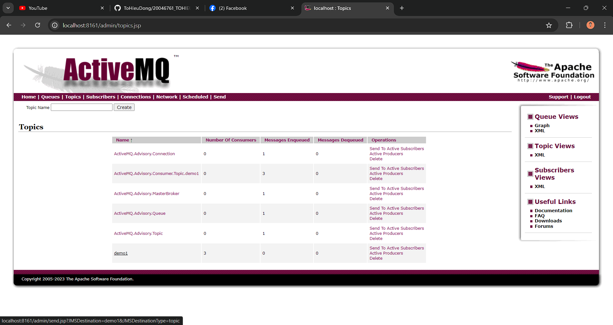
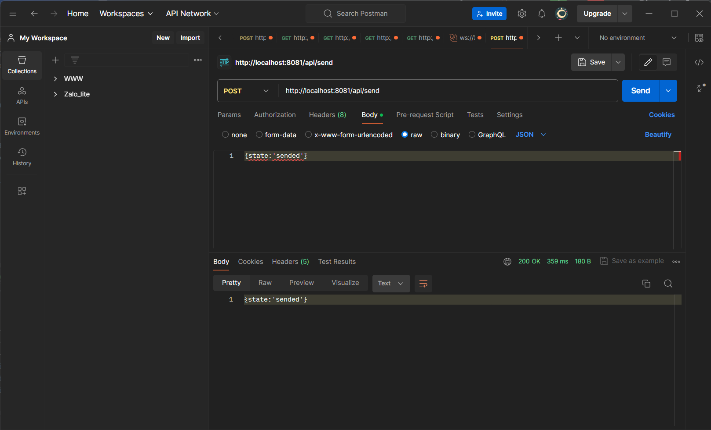
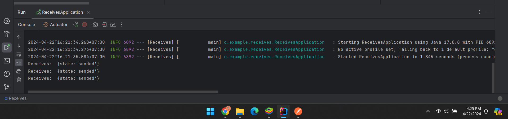

# 20046761_TOHIEUDONG_KTPM_WEEK10
Bài tập tuần 10

Yêu cầu:To work with ActiveMQ, we should configure some beans that are needed for jms working like, connection factory, jsm template, and so on.

Chạy với Active MQ:

Gửi 1 đoạn JSON bằng posman:

Nhận tin nhắn dạng JSON:

